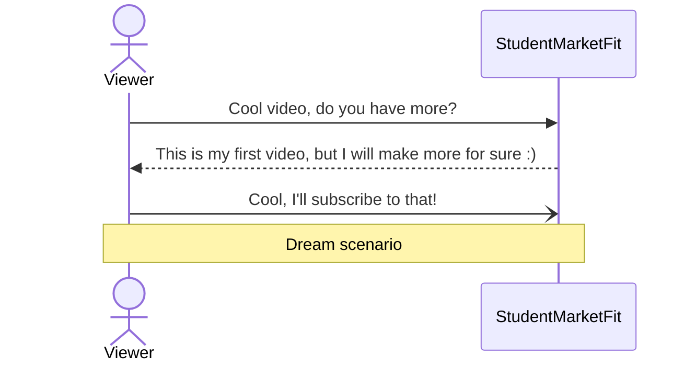

# Statistics 101
*A course by Student Market Fit*

### Lecture 1: Getting started
Fixed typo and am ready to start

#### Syntax
**Bold face**

*Italic*

List
- A
- B

Numbered list
1. A
2. B


#### Code blocks
Code syntax inline `if (user_sees_video is True)`

Code blocks:
```python
if (viewer_is_happy is True):
    print("Please subscribe!")
```

#### Equations
How about equations?
$$\left( \sum_{k=1}^n a_k b_k \right)^2 \leq \left( \sum_{k=1}^n a_k^2 \right) \left( \sum_{k=1}^n b_k^2 \right)$$


#### Diagrams (made with mermaid)

